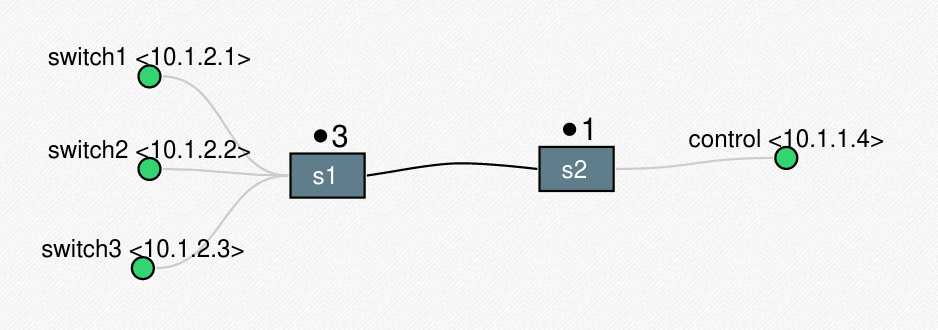

# clock_sync

sudo python3 orquestrador.py -m clock_off
clock synchronization algorithm

## Requisitos:
ZMQ:
* pip install pyzmq

Python 3 (&ge; 3.3):
* apt install python3

## How to run:
Execução com sincronização:
* sudo python3 orquestrador.py -m clock_on

Execução sem sincronização:
* sudo python3 orquestrador.py -m clock_off

Execução com delay (em desenvolvimento):
* sudo python3 orquestrador.py -m delay

How it works:
**clock_sync** is a logical clock synchronization algorithm based on both NTP and Berkeley algorithm. We consider the following topology for our experiments:

